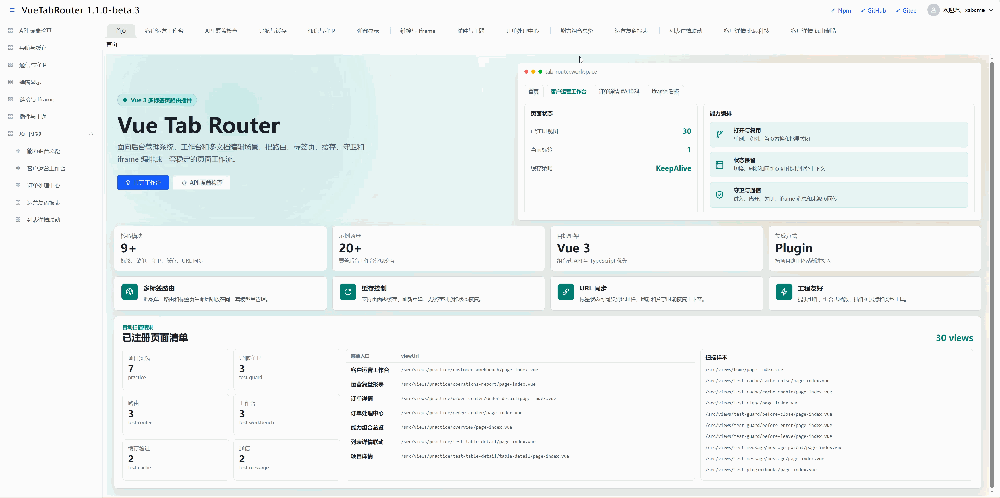

# VueTabRouter

VueTabRouter 是一个面向 Vue 3 的多标签页路由插件，适用于后台管理系统、业务工作台、多文档编辑、报表平台和 iframe 集成等场景。



它解决的不是“渲染一排 Tabs”这么简单的问题，而是把页面打开、复用、缓存、刷新、关闭、守卫、iframe 承载、菜单联动、URL 同步和页面通信收敛到统一的 `TabsManager` 中。

## 仓库内容

本仓库是 pnpm workspace + Turborepo 管理的 monorepo，包含插件源码、文档站点和本地 demo。

```txt
vue-tab-router/
├── docs/                 # VitePress 文档站点
├── examples/
│   ├── vue-tab-router/   # 核心包本地演示项目
│   └── vue-router-tab/   # Vue Router 适配包演示项目
├── packages/
│   ├── vue-tab-router/   # 核心插件包 @xsbcme/vue-tab-router
│   └── vue-router-tab/   # Vue Router 适配包 @xsbcme/vue-router-tab
├── scripts/              # 发布、部署、日志同步脚本
├── media/                # README 与包页面展示素材
├── pnpm-workspace.yaml
├── turbo.json
└── package.json
```

## 文档分工

为了避免同一份插件说明在多个 README 中重复维护，根 README 只作为仓库入口，介绍项目定位、目录结构、开发命令、发布和部署流程。

更细的插件使用说明请看：

- 插件包 README：[packages/vue-tab-router/README.md](packages/vue-tab-router/README.md)
- 文档站源码：[docs](docs)
- 核心包示例：[examples/vue-tab-router](examples/vue-tab-router)
- Vue Router 适配示例：[examples/vue-router-tab](examples/vue-router-tab)
- 在线文档：https://xsbcme.github.io/vue-tab-router/doc/
- 在线 Demo：https://xsbcme.github.io/vue-tab-router/demo/
- Vue Router 适配 Demo：https://xsbcme.github.io/vue-tab-router/router-tab-demo/
- NPM 包：https://www.npmjs.com/package/@xsbcme/vue-tab-router

## 核心能力概览

- **页面管理**：组件页面、iframe 页面、外链页和相对链接页统一通过 `openTab()` 打开。
- **工作台体验**：支持首页、置顶、多开、单例复用、批量关闭、刷新、不可关闭和禁止拖拽。
- **状态保留**：支持组件 keep-alive 缓存和 iframe 缓存，适合列表、详情、审批、报表等高频切换场景。
- **流程控制**：提供全局守卫和页面级守卫，可处理权限校验、未保存确认、关闭前确认等业务流程。
- **导航协同**：支持菜单联动、面包屑、URL 同步和页面元数据，降低 tab、菜单、页面层级之间状态不一致的问题。
- **扩展机制**：支持插件 hooks、事件通信、存储适配器和 scoped manager，方便项目级扩展。

## 与后台基础框架的关系

VueTabRouter 不是完整后台模板，也不替代 Vue Router。它更关注多标签工作台运行时本身，适合已有 Vue 项目按需接入。

如果项目需要从零搭建一整套后台系统，可以选择成熟中控台框架；如果项目已经有自己的权限、菜单、UI 和工程规范，只是缺少稳定的多标签工作台内核，VueTabRouter 会更轻量。

## 快速入口

安装插件：

```bash
pnpm add @xsbcme/vue-tab-router
```

如果项目以 Vue Router 路由表为标签页来源，可以安装适配包；它会自动带入底层核心包：

```bash
pnpm add @xsbcme/vue-router-tab vue-router
```

完整接入示例、`import.meta.glob` 页面入口约定、`openTab(viewUrl)` key 规则、Vue Router 协同方式和 API 说明，请阅读 [packages/vue-tab-router/README.md](packages/vue-tab-router/README.md) 或在线文档。

## 开发指南

### 环境要求

- Node.js >= 18
- pnpm >= 8

### 常用命令

| 命令                         | 说明                      |
| ---------------------------- | ------------------------- |
| `pnpm install`               | 安装依赖                  |
| `pnpm build`                 | 构建所有包                |
| `pnpm dev`                   | 启动所有开发任务          |
| `pnpm dev:demo`              | 启动核心包 demo           |
| `pnpm build:demo`            | 构建核心包 demo           |
| `pnpm dev:router-tab-demo`   | 启动 Vue Router 适配 demo |
| `pnpm build:router-tab-demo` | 构建 Vue Router 适配 demo |
| `pnpm type-check`            | 运行类型检查              |
| `pnpm test`                  | 运行测试                  |
| `pnpm release:change`        | 编写发布变更日志          |
| `pnpm release:beta`          | 准备 beta 版本与文档日志  |
| `pnpm release:latest`        | 准备正式版本与文档日志    |

### 本地文档与 Demo

启动所有开发任务：

```bash
pnpm dev
```

只启动本地 demo：

```bash
pnpm dev:demo
```

## 发布包

发布由 changesets 生成插件包版本和包内日志，再同步到文档日志页。npm 发布通过 GitHub Actions 手动触发，不在仓库中保存 npm token。

changesets 只用于 `@xsbcme/vue-tab-router` 插件包。docs、demo、Pages、构建脚本等外层改动可以随版本提交，但不要写入 changeset 发布日志；`pnpm changeset:check` 会阻止非插件包日志进入发布流程。

### 发布 beta

```bash
pnpm release:change
pnpm release:beta
git add .
git commit -m "chore: prepare beta release"
git push
```

推送后到 GitHub Actions 运行 `Release NPM`，选择 `beta`。

beta 版本处于 changesets pre mode 时，npm dist-tag 会由 `.changeset/pre.json` 自动使用 `beta`，发布脚本不会额外传 `--tag beta`。

### 发布正式版

```bash
pnpm release:change
pnpm release:latest
git add .
git commit -m "chore: prepare stable release"
git push
```

推送后到 GitHub Actions 运行 `Release NPM`，选择 `latest`。

### 发布命令

| 命令                  | 说明                                       |
| --------------------- | ------------------------------------------ |
| `pnpm release:change` | 编写 changeset 变更说明                    |
| `pnpm release:beta`   | 进入 beta 通道、生成版本、同步文档日志     |
| `pnpm release:latest` | 退出预发布通道、生成正式版本、同步文档日志 |
| `pnpm release:check`  | 检查 changeset 范围、文档日志、类型和测试  |

`pnpm changeset:check`、`pnpm changelog:sync` 和 `pnpm changelog:check` 是底层命令，通常不需要直接使用；发布准备脚本会自动检查日志范围并同步文档日志。

### GitHub 配置

- 在 `npm-beta` 和 `npm-latest` environment secrets 中配置 `NPM_TOKEN`。
- 建议给 `npm-latest` 配置 required reviewers。
- workflow 会校验版本号和发布标签，`1.0.0-beta.x` 只能发布到 `beta`，正式版本只能发布到 `latest`。

## 部署文档与 Demo

项目采用 GitHub Pages 合并部署：根目录只保留入口页，VitePress 文档放到 `doc/`，Demo 放到 `demo/`。

访问路径：

- 入口页：`https://xsbcme.github.io/vue-tab-router/`
- 文档首页：`https://xsbcme.github.io/vue-tab-router/doc/`
- 在线 Demo：`https://xsbcme.github.io/vue-tab-router/demo/`
- Vue Router 适配 Demo：`https://xsbcme.github.io/vue-tab-router/router-tab-demo/`

本地构建 Pages 产物：

```bash
pnpm build:pages -- --base /vue-tab-router/
```

构建产物位于 `dist/pages`。推送到 `main` 或 `master` 后，GitHub Actions 会自动构建并发布该目录。首次启用时，需要在 GitHub 仓库 `Settings -> Pages` 中将部署来源设置为 `GitHub Actions`。

## 链接

- **NPM 包**：[@xsbcme/vue-tab-router](https://www.npmjs.com/package/@xsbcme/vue-tab-router)
- **插件 README**：[packages/vue-tab-router/README.md](packages/vue-tab-router/README.md)
- **核心示例**：[examples/vue-tab-router](examples/vue-tab-router)
- **Vue Router 适配示例**：[examples/vue-router-tab](examples/vue-router-tab)
